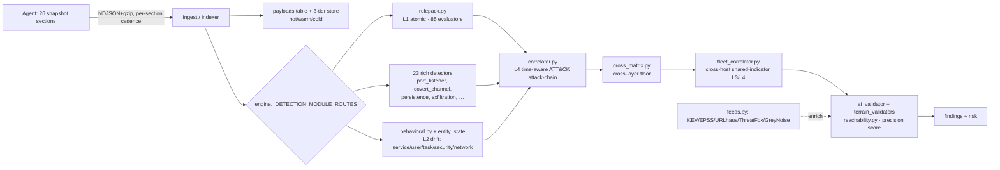

# Detection_pack — Gap Analysis & System-Design Review

**Reviewer role:** principal detection engineer + threat hunter + platform architect.
**Date:** 2026-08-16.
**Inputs:** `Detection_pack/00–50` (the target design) vs. the implemented AttackLens
manager (`manager/manager/attacklens/**`, `shared/**`, `agent/**`).
**Method:** every "current-state" claim below is grounded in a named file; inferences and
unverified items are flagged explicitly. Nothing here is a claim of production readiness.

---

## 0. Executive summary

`Detection_pack` is an **excellent, principal-grade detection design** — a 5-layer model
(atomic → drift → rarity → correlation-chain → statistical), ~120 rules across the AI/agent,
execution/persistence, network/container, and supply-chain surfaces, 8 ATT&CK-tactic-breadth
correlation chains, an enrichment matrix, and a rarity-weighted risk score. Its schema
discipline (`fp` + `validation` mandatory to ship) is the right quality gate.

The implemented platform is **much closer to this target than a first read suggests** — it is a
genuine multi-layer system, not a stateless rule matcher. The three gaps that actually matter:

| # | Gap | Impact | Effort |
|---|-----|--------|--------|
| **G1** | **Telemetry is snapshot-only; no exec/file/socket event stream** | ~25–30% of pack rules (event-window logic) are structurally unreachable or best-effort | High (new ingestion path) |
| **G2** | **AI/agent/extension surface is thinly covered** (`developer_security.py` = 9 conditions vs pack-10's ~27) | The platform's *differentiator* surface (MCP rug-pull, agent autonomy, repo-injection, exposed inference) is under-detected | Medium (mostly snapshot-evaluable) |
| **G3** | **Supply-chain enrichment is incomplete** (no OSV / deps.dev / GitHub-Advisory / WHOIS / JA3) | Can't detect npm/PyPI *malware advisories*, dependency-confusion, or newly-registered-domain egress | Medium (async feed additions) |

Everything else is either already implemented, a tuning/governance concern, or a smaller
targeted rule addition. Details and a sequenced roadmap follow.

---

## 1. What the Detection_pack is (target design)

- **5 detection layers** (`00-…md §3`): **L1 atomic** (bad config / known-bad now), **L2
  drift** (object_hash changed between snapshots), **L3 rarity** (`fleet_prevalence`,
  per-host-role baseline), **L4 correlation chains** (ordered L1–L3 signals scored on ATT&CK
  tactic *breadth*), **L5 statistical** (beaconing, exfil ratio, mining, telemetry gaps).
- **Normalized object model** (`§2.1`): every collector row → one `object` with a stable
  `object_key` and an `object_hash` that **excludes volatile fields** (PIDs, timestamps, byte
  counts) so snapshots don't produce phantom drift.
- **Enrichment matrix** (`§2.2`): MITRE, NVD, CISA KEV, EPSS, OSV, deps.dev, GitHub Advisory,
  abuse.ch (ThreatFox/URLhaus/MalwareBazaar), Spamhaus/ET/Tor/CINS, GreyNoise, VirusTotal
  (hash-only), Sigma, Atomic Red Team. Hygiene: cache, never block detection on a fetch,
  never send internal identifiers to third parties.
- **Risk score** (`§4`): `base[sev] × confidence × rarity_mult × asset_crit × intel_mult`,
  host aggregation with exponential decay, **+50% chain bonus** when ≥3 ATT&CK tactics span 24h.
- **8 correlation chains** (`50-…md §1`): supply-chain→cred-theft→exfil, agentic-AI prompt
  injection, macOS infostealer, persistence-after-exec, defense-evasion (bidirectional),
  container-escape, lateral-movement, pre-ransomware.
- **Operating model:** detection-as-code, 14-day learn window per new host role, suppression
  (owner+expiry) not deletion, ATT&CK-Navigator coverage map, dead-man switch on agent silence.

---

## 2. What is actually implemented (current architecture)

Confirmed from code. The engine runs **several detection paths per section**, then a precision
pipeline — this is materially more than "match a rule against one row."

**Layer coverage — how the target maps to reality:**

| Layer | Target (pack) | Implemented | Evidence | Verdict |
|-------|---------------|-------------|----------|---------|
| **L1 atomic** | most rules | `rulepack.py` (85 evaluators) + 23 routed rich detectors | `engine.py:_DETECTION_MODULE_ROUTES`, `detections/*.py` | **Strong** |
| **L2 drift** | object_hash change | `behavioral.py` fingerprint-diff via `entity_state` for **service/user/task/security/network** | `behavioral.py:275–523`, `indexer.py:481` (entity_state DDL) | **Partial** — 5 entity types; not extensions/MCP/git/sudoers/sshd/persistence-plist/binary-hash |
| **L3 rarity/baseline** | `fleet_prevalence`, per-role baseline | per-metric baselines + `fleet_correlator` grouping confirmed findings by shared indicator | `engine.py:238–251`, `fleet_correlator.py` | **Partial** — no raw *object* prevalence (host-count per object_key); no per-host-role learn-window gating |
| **L4 chains** | ordered ATT&CK-tactic-breadth | `correlator.py` "time-aware cross-section attack-chain, ordered MITRE tactics"; `cross_matrix.py`; `custom_correlations(layer=correlation)` | `correlator.py:2–50`, `cross_matrix.py` | **Present** — verify it scores *tactic breadth* and covers the 8 named chains |
| **L5 statistical** | beaconing/exfil/mining/gaps | `covert_channel.py`, `exfiltration.py`, `_baseline_anomaly_score`, `agent_health.py` (dead-man) | `detections/covert_channel.py`, `ai_validator.py:323` | **Partial** — depth of beaconing/jitter + exfil-ratio math not fully audited |
| **Enrichment** | KEV/EPSS/OSV/deps.dev/NVD/abuse.ch/WHOIS/JA3/VT | KEV, EPSS, URLhaus, ThreatFox, GreyNoise, malicious IP/hash | `feeds.py:10–206` | **Partial** — see G3 |
| **Reachability** | SCA join (§50) | `reachability.py` package↔process↔port join over `payloads` | `reachability.py` (implemented 2026-08-12) | **Aligned** |
| **Risk score** | rarity×asset×intel, decay, chain bonus | terrain/precision weighted factors + AI verdict | `terrain_validators.py`, `ai_validator.py` | **Different model, comparable intent** — no explicit `fleet_prevalence` multiplier |

**Bottom line:** the platform already realizes L1 fully, L2/L3/L4/L5 partially, and a KEV/EPSS/
abuse.ch enrichment core. The pack is the right north star; the deltas are specific, not
foundational.

---

## 3. The central architectural finding (G1): snapshot-only, no event stream

**Evidence.** All 26 canonical sections in `shared/sections.py` are periodic **inventory
snapshots** (`volatile` 10s → `inventory` 24h). `processes` carries `ppid`, `cmdline`,
`hash_sha256` (`shared/schema.py:81,88,295`) — point-in-time attributes, **but there is no
exec/file-write/socket event collector** (searched `agent/`, `shared/`). The pack's stated
assumption (`00-…md §Assumption`) is *"snapshots **plus** an event stream."* The platform has
the first half only.

**What snapshots CAN do well** (point-in-time predicates on a row): PROC-0001/0003/0005/0006/
0007/0008/0009 (cmdline/path/signature patterns), PORT-000x, PERS-0002/0003, CRON-0001,
SHELL-0002/0003, USER-0003, CRED-000x, CNT-000x, SEC/SYSCTL/NETCFG config states, SCA-0001
(reachability). Most L1 rules are feasible today.

**What snapshots CANNOT do faithfully** (need events or sub-interval windows):

| Rule | Why it needs events |
|------|---------------------|
| PROC-0004 / AICLI-0004 | "parent spawned child **within 60s**" — a snapshot only shows *co-existing* processes; a curl child that exits in 2s is invisible between 10s snapshots |
| OF-0002 | "≥4 credential files opened **within 120s** by one pid" — open-file *events*, not an fd snapshot |
| HW-0001 | "HID insert **then** ≥5 non-user execs within 60s" — insertion + exec *timing* |
| BIN-0003 / MNT-0001 | quarantine-xattr **transition**, DMG-mount **event** |
| PROC-0002 | process running from a **deleted/replaced** image (running_hash ≠ disk_hash at exec) |
| AH-0002 | agent log inode/size **decrease** event |
| NET-0003/0004 | beaconing/exfil need per-connection byte/interval *series*, not a connection snapshot |

Snapshot-diffing via `entity_state` (behavioral.py) **approximates** drift, but it structurally
**misses anything that starts and ends inside one snapshot interval** — exactly the fast,
high-value malicious actions (reverse shell, `curl|sh`, credential burst).

**This is the same failure class the platform already learned twice:** the validation-reachability
bug ("authoritative-but-inoperative") and the 6 rule-pack rules I reclassified from `stable →
experimental` on 2026-08-16 because a per-item snapshot evaluator cannot express windowed/absence/
flow logic (`LEARNINGS.md` 2026-08-16). The honest architectural choice is one of:

- **(A) Add an event-stream ingestion path** (macOS EndpointSecurity / `eslogger`, Linux eBPF or
  `auditd`, Windows ETW/Sysmon) as new event sections feeding a **separate stateful windowed
  correlation engine** (keyed by (host,pid), bounded ring buffers, explicit window+watermark).
  Unlocks the whole event-dependent rule class. Highest leverage, highest cost.
- **(B) Explicitly scope event-window rules as "not supported on snapshot telemetry"** and label
  them (as we did with the 6 reclassified rules) so product status stays truthful — then close
  the ones that *are* snapshot-expressible.

Do **not** silently implement event-window rules against snapshots and call them `stable`; that
recreates the inoperative-checklist failure mode.

---

## 4. Enrichment / required-sources gap (G3)

`feeds.py` implements KEV, EPSS, URLhaus, ThreatFox, GreyNoise, malicious-IP/hash. Missing vs the
pack, in priority order:

| Missing source | Unlocks | Rules blocked today |
|----------------|---------|---------------------|
| **OSV.dev / GitHub Advisory (MALWARE type)** | npm/PyPI/Go **malware** advisories (not just CVEs) | **PKG-0004** (known-malware package), PKG-0002 provenance |
| **deps.dev** | maintainer count / age / dependents | PKG-0002 (compromised-maintainer window) |
| **WHOIS age** | newly-registered-domain egress | **NET-0002**, MCP-0006, AIAPP domain rules |
| **JA3/JA4 + cert-transparency** | C2 TLS fingerprinting | NET-0006, NET-0003 pivot |
| **NVD detail / CPE** | precise version-range CVE match | SCA precision (KEV/EPSS core already present) |
| **VirusTotal hash-only** | binary reputation (≥5 vendors) | BIN-0005 (curated feed already partial via abuse.ch) |

All are async, cacheable, and free/low-tier — they fit `feeds.py`'s existing model. **OSV + GitHub
Advisory is the single highest-value add** because supply-chain malware (the pack's dominant
threat model) is invisible without it, and this platform's deep-mesh already inventories npm/pip/
homebrew packages.

**Required-collector deltas** (data the rules need that the agent may not emit — verify against
`agent/os/*/collectors`): TCC grants (APP-0002), code-signing entitlements (BIN-0004),
`com.apple.quarantine` xattr (BIN-0003), MCP **tool descriptions** (MCP-0003/0004),
`allowed_origins` for native-messaging manifests (NMH-0002), `StartInterval`/`KeepAlive`
(PERS-0004), USB HID device class (HW-0001), TLS SNI/cert (NET-0006). Each missing field silently
degrades a rule to no-op — the same trap as the reachability bug; treat "field availability" as a
first-class gate (pack `§Detection development lifecycle` step 3).

---

## 5. Rule/domain coverage — data-specific area check

Mapping the 26 sections → pack domains → current detector → biggest gap. ✅ solid · 🟡 partial · ❌ thin/absent.

| Section(s) | Pack domain(s) | Current detector | Coverage | Top missing rule(s) |
|---|---|---|---|---|
| developer_security | editor/browser ext, MCP, native-msg, ai_cli, ai_apps | `developer_security.py` (AL-DEV-001..009) | ❌ **~35%** | MCP-0003/0004 (tool desc drift/injection), AICLI-0001/0002/0003 (autonomy, hooks, repo-injection), AIAPP-0001 (exposed inference), AIAPP-0002 (pickle), EXT-0003/0004/0005/0006 |
| packages, sbom, sca | node/py/homebrew, SBOM, CVE | `package_vulnerability.py`, `sbom_posture.py`, `sca_compliance.py`, `reachability.py` | 🟡 | PKG-0001 (install-script scan), PKG-0003 (typosquat/dep-confusion), PKG-0004 (OSV malware), PKG-0005 (lockfile integrity), PKG-0007 (.pth persistence) |
| processes | processes | `rulepack` + `covert_channel`+`exfiltration`+`privilege_escalation` | 🟡 | event-window: PROC-0002/0004 (see §3) |
| services, tasks, configs | launchd/cron/tasks/shell | `persistence.py`, `scheduled_task.py`, `service_monitor.py` | ✅/🟡 | SHELL-0002/0003 (shell-startup content); confirm plist/unit drift |
| binaries, apps | binaries, apps | `binary_integrity.py`, `app_vulnerability.py` | 🟡 | BIN-0003 (quarantine strip — event), APP-0002 (TCC — field) |
| users, security, sysctl | users/security/sysctl | `user_account.py`, `defense_evasion.py`, `sysctl_monitor.py`, behavioral drift | ✅ | USER-0004 sudoers content, SEC-0002 trust-store/CA |
| connections, network, arp | connections/network/arp | `lateral_movement.py`, `exfiltration.py`, `covert_channel.py`, `arp_spoofing.py` | 🟡 | NET-0002 (WHOIS), NET-0006 (JA3), NET-0003/0004 need flow series |
| ports | ports | `port_listener.py` | ✅ | PORT-0005 (tunneling utils — process cmdline, feasible) |
| containers | docker/k8s | `container_security.py` (69K) | ✅ | CNT-0005 kubelet-anon (field) |
| mounts, storage, hardware | mounts/storage/hw | `mount_monitor.py`, `hardware_integrity.py` | 🟡 | HW-0001 (BadUSB — event), STOR-0001 (backup-destruction cmdline, feasible) |
| agent_health, metrics, battery | agent health / mining | `agent_health.py`, `battery_health.py` | ✅ | AH-0001 dead-man already mapped here (2026-08-16) |
| git, credential_locations, openfiles | git / creds / open-files | `developer_security.py` (partial), `rulepack` OPEN_FILES-001 | 🟡/❌ | GIT-0001/0002 (hooksPath/insteadOf/filter), CRED-0003 (keychain-dump cmdline), OF-0002 (event) |

**Highest-ROI coverage work** is the developer_security surface (G2): most missing pack-10 rules
are **snapshot-evaluable today** because the deep-mesh capability payload already carries tool
descriptions, config files, listener info, and cmdlines — they need detector logic, not new
telemetry. This is also the platform's competitive differentiator.

---

## 6. Detection-quality & edge-case review (threat-hunter lens)

Issues to design for — several are latent in *any* state-based detector and must be handled:

1. **object_hash volatile-field discipline.** The pack (`§2.1`) is explicit: hash security-relevant
   fields only. Verify `behavioral.py` fingerprints **exclude** PIDs/timestamps/byte-counts, or
   every snapshot reads as drift and L2 becomes noise. **Edge case:** a service whose only change
   is a new PID must not fire PERS-drift.
2. **Snapshot-cadence blind spot.** A reverse shell alive <10s never appears in `volatile`. Document
   this as a known blind spot (pack requires "known blind spots" per rule); don't claim exec
   coverage the cadence can't deliver.
3. **Reachability edge cases** (SCA-0001 / `reachability.py`): bundled/renamed binaries (`libwebp`
   inside `Google Chrome`), statically-linked libs, and interpreted deps (a vuln npm module loaded
   by `node`) won't match `canonical_name`. The SQL join in `50-…md` is `LIKE '%component%'` which
   over-matches; the implemented token-canonicalization under-matches. Both directions need test
   fixtures. **Never treat "not reachable" as "not vulnerable"** for internet-facing services.
4. **Fleet prevalence ≠ finding grouping.** `fleet_correlator` groups *confirmed findings* by shared
   indicator (worm/supply-chain) — valuable, but it is **not** the pack's L3 primitive, which is
   raw *object* rarity (extension on 1/4000 hosts) computed **before** anything is a finding. That
   primitive (distinct-host count per `object_key`) is missing and is "the single best supply-chain
   lead" per the pack. Add it.
5. **Learn-window governance.** Pack ships L3 rules disabled 14 days per new host role. Behavioral
   baselines exist, but if a brand-new host's first snapshot seeds "normal," an attacker present at
   enrollment becomes the baseline. Gate drift/rarity alerts on `baseline_days >= N` and host-role.
6. **Allowlist governance.** Current allowlists are env sets (`_split_env`) with no owner/reason/
   **expiry**. A stale allowlist is a permanent blind spot (pack `§Detection quality rules`: treat
   allowlists as governed data with expiration). Move to a table with owner+reason+scope+expiry;
   suppression, never silent disable.
7. **Event-time vs ingest-time / out-of-order.** The platform already rejects malformed event-time
   and separates it (pipeline acceptance work). Extend the same discipline to drift: an
   out-of-order snapshot must not register a false "reverted then re-changed" drift pair.
8. **Missing-logs ≠ safe.** AH-0001/MET-0002 (dead-man + collector starvation) must gate downstream
   "all clear." Confirm `agent_health` silence *raises* rather than merely lowering confidence, and
   that a disabled collector doesn't read as "section clean."
9. **Tenant isolation.** If the manager is ever multi-org, `fleet_prevalence` and `fleet_correlator`
   must be tenant-scoped or one tenant's rarity leaks another's inventory. Make the boundary explicit
   before adding fleet-prevalence.
10. **Prompt-injection surface (AI validator).** The pack's MCP-0004/AICLI-0003 detect injection in
    tool descriptions and repo instruction files — which are the *same* untrusted strings the
    platform's own AI validator ingests. Ensure detector inputs stay in the `<untrusted>` boundary
    already established in `ai_validator` so a poisoned tool description can't steer the validator.

---

## 7. Prioritized roadmap (system design)

Sequenced by value/effort, reusing existing seams (`feeds.py`, `detections/<section>.py`,
`entity_state`, `_DETECTION_MODULE_ROUTES`). Each item ships detection-as-code: schema + `fp` +
positive/negative fixtures, mirroring `test_detection_rules_verification.py`.

**Phase 1 — close snapshot-evaluable gaps (weeks, medium effort, no new telemetry)**
- **P1. developer_security depth (G2).** Add MCP-0003 (tool-description drift via `entity_state`),
  MCP-0004 (injection-language match), AICLI-0001 (autonomy flags in `processes.cmdline`),
  AICLI-0003 (repo instruction-file directives), AIAPP-0001 (inference server on 0.0.0.0),
  AIAPP-0002 (pickle model source), EXT-0004/0005/0006, GIT-0001/0002. Most read fields already
  present in the deep-mesh + `processes`/`configs` snapshots.
- **P2. OSV + GitHub-Advisory enrichment (G3).** Add async batch clients to `feeds.py`
  (OSV `querybatch` ≤1000, GH Advisory GraphQL `MALWARE`), cache per pack hygiene, re-score
  asynchronously. Unlocks PKG-0004 and sharpens SCA.
- **P3. Snapshot-expressible supply-chain rules.** PKG-0001 (install-script content scan on
  package metadata), PKG-0003 (typosquat/dep-confusion), PKG-0005 (lockfile integrity), PKG-0007
  (.pth persistence). Data is in the `packages`/`sbom` deep-mesh.

**Phase 2 — the rarity primitive + governance (weeks, medium)**
- **P4. Fleet object-prevalence.** A `object_prevalence(object_key) = distinct_hosts / hosts_reporting`
  aggregate (batch job over `payloads`, tenant-scoped), fed into the risk score as `rarity_mult`
  and into EXT-0002/PORT-0002/PKG-0002/PROC-0003. This is the pack's highest-value, most-skipped
  signal.
- **P5. Allowlist + learn-window governance.** Governed allowlist table (owner/reason/scope/expiry);
  gate L2/L3 alerts on `baseline_days` and host-role. Precision + audit.
- **P6. Enrichment breadth.** WHOIS-age (NET-0002/MCP-0006), NVD-CPE detail, VT hash-only.

**Phase 3 — the event stream (quarter, high effort) — G1**
- **P7. Event ingestion.** macOS EndpointSecurity/`eslogger`, Linux eBPF/auditd, Windows Sysmon →
  new `*_events` sections → a **separate stateful windowed correlation service** (bounded per-(host,
  pid) windows, watermarks, at-least-once + idempotent). Unlocks PROC-0002/0004, OF-0002, HW-0001,
  BIN-0003, AICLI-0004, NET-0003/0004, and the full CHAIN-00x fidelity.
- **P8. Chain scoring parity.** Confirm/extend `correlator.py` to score **ATT&CK-tactic breadth**
  (+50% at ≥3 tactics/24h) and encode CHAIN-001..008 explicitly.

**Cross-cutting:** ATT&CK-Navigator coverage export (CI-validated live technique IDs), per-rule
precision + blind-spot metadata, and CI replay against a labelled corpus (Atomic Red Team + a
golden benign fleet sample) — the pack's operating model, largely missing today.

---

## 8. What NOT to do (risks)

- **Don't** implement event-window rules against snapshots and mark them `stable` — that is the
  inoperative-checklist failure the platform already hit twice. Scope or reclassify honestly.
- **Don't** add `fleet_prevalence` before deciding the tenant boundary — it's a cross-host data-leak
  vector otherwise.
- **Don't** block detection on enrichment API calls (pack `§2.2`) — fire, then re-score async.
- **Don't** send internal hostnames/repo names to third-party feeds; hash-only for VT.
- **Don't** treat unreachable/quiet as safe — reachability and telemetry-gap are *inputs*, not
  verdicts.

---

## 9. Appendix — verdict per pack layer

| Layer | Feasible on current telemetry | Needs new telemetry | Recommended action |
|-------|-------------------------------|---------------------|--------------------|
| L1 atomic | ~85% of pack L1 | quarantine-xattr, TCC, entitlements, tool-desc, JA3 | Phase 1 rules + collector fields |
| L2 drift | service/user/task/security/network done; extend to ext/MCP/git/plist/binary-hash | binary on-disk-hash-at-exec | Phase 1–2, `entity_state` |
| L3 rarity | finding-grouping done | **object prevalence + learn-window** | Phase 2 |
| L4 chains | time-aware ATT&CK chain present | event fidelity for tight chains | verify + Phase 3 |
| L5 statistical | mining/exfil/dead-man partial | per-flow series for beaconing | Phase 3 |

**Definition of done for this review:** target understood, current state evidenced (not assumed),
gaps ranked by impact/effort, edge cases enumerated, a sequenced design that reuses existing seams,
and the honesty rule preserved — no rule ships as `stable` that the telemetry can't actually
evaluate.
