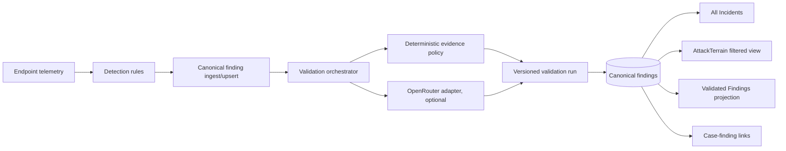

# AttackTerrain, Validation, Cases, Refresh, and Responsive UX Plan

Date: 2026-08-14  
Status: core implementation completed and regression-tested; production gates remain explicit  
Companion research: [OpenRouter validation-engine research](./openrouter-validation-engine.md)

## 1. Outcome and product invariants

The platform should have one canonical finding lifecycle, not separate records for AttackTerrain, All Incidents, Validated Findings, and cases.

The required list relationships are:

```text
AttackTerrain(terrain T, query Q) = AllIncidents(query Q AND terrain = T)

ValidatedFindings(query Q) =
  AllIncidents(query Q AND validation_state = "validated")

Case findings = links to canonical findings; cases never copy finding records.
```

These equalities apply for the same time range, active/closed view, permissions, and query filters. They should become automated contract tests, not UI assumptions.

The target flow is:



The LLM may recommend a verdict. It must not directly mutate finding status, create a case, or bypass mandatory evidence policy.

## 2. Confirmed state at the initial audit

| Area | Current behavior | Assessment |
|---|---|---|
| Canonical storage | The main terrain pages and `/api/v1/detection/all` read the shared `findings` table. | Good foundation |
| All Incidents | Returns active findings by default, including low validation scores. | Correct intent |
| AttackTerrain | Origin, Vector, Citadels, and Mesh pages call the same all-detections endpoint with `terrain_id`. | Mostly correct |
| Mesh routing | `developer_security` is mapped to `mesh`, and old rows are backfilled. | Implemented |
| Mesh rules | Nine rules, `AL-DEV-001` through `AL-DEV-009`, cover extensions, MCP, PATH, browser native messaging, Git overrides, credentials, listeners, and containers. | Positive-path coverage exists |
| Mesh validation | `TERRAIN_CRITERIA` has no `mesh` entry. Mesh silently falls back to Origin vulnerability criteria. | P0 correctness bug |
| All Incidents terrain filters | The `TerrainTab` and count model omit Mesh. Mesh can appear in All but cannot be selected as a terrain tab. | P0 UI gap |
| Validated Findings | Active view requests `validated_only=true` and uses agent → terrain → global threshold resolution. | Partially correct |
| Closed Validated view | The closed view does not consistently request `validated_only=true`. | Semantic gap |
| Validated sidebar badge | It counts new findings without the validated-only filter. | Incorrect badge |
| Query/filter handling | Many advanced filters are applied in the browser after fetching only 500 rows. | Results and counts can be incomplete |
| ID lookup | `/detection/all` returns early for `id_search`; validation and other filters are not consistently applied. | Contract bypass |
| Pagination | `/detection/all` has no reliable total/facets response; UI slices a bounded result set. | Scale/correctness risk |
| Terrain taxonomy | Category-to-terrain maps are duplicated in validation, settings, AI validation, and sidebar navigation. Some copies disagree. | Drift risk |
| Pre-emission validation | Confidence threshold, eight deterministic gates, and optional AI precision gate are implemented. | Useful but conflated |
| Score persistence | AI precision may decide promotion, then `precision_score` is overwritten with the terrain score. | P0 audit/semantic bug |
| Gate explainability | Emitted findings store `validation_gates_passed` as an empty list. | Incorrect provenance |
| Minimum evidence strength | Settings persist `validation_min_strength`, while gate G7 reads static `quality_floor_strength`. | Dead setting |
| AI errors | Some AI failures allow emission without an explicit degraded/pending state. | Fail-open is invisible |
| Live AI wiring | The engine receives the legacy Anthropic-only `AIAnalyst`, while the validator calls a `_get_provider()` method that class does not implement. Saved OpenRouter settings are not used by this path. | OpenRouter validation is currently disconnected |
| OpenRouter | Basic chat support and hard-coded fallback models exist. | Not production-safe yet |
| AI task model settings | Per-task selections are persisted to JSON but are not consumed by runtime selection. | Dead configuration |
| Post-finding validation | A separate CVE validator checks NVD/KEV/ExploitDB. | Valuable, but shares ambiguous “validation” naming |
| Cases | All Incidents has browser-only `al_cases`; detail view has one DB row per finding; Validated Findings edits finding workflow fields. | Three incompatible models |
| Central refresh | The header increments a nonce, but the main detection hook does not consume it. Spinner lasts a fixed two seconds. | Partial/non-truthful refresh |
| Relative/absolute ranges | Relative ranges poll. Absolute-picker refresh can reapply the same query string and perform no request. | Manual refresh bug |
| Responsive shell | Custom sidebar is fixed at 220 px and cannot collapse; multiple panels have fixed widths. | Desktop-biased |

Primary local evidence:

- `manager/manager/attacklens/detections/developer_security.py`
- `manager/manager/attacklens/terrain_validators.py`
- `manager/manager/attacklens/engine.py`
- `manager/manager/attacklens/ai_validator.py`
- `manager/manager/ai/providers.py`
- `manager/manager/api/detection.py`
- `manager/manager/api/findings.py`
- `manager/manager/api/settings.py`
- `manager/manager/api/cases.py`
- `manager/manager/indexer.py`
- `manager/dashboard/templates/Build Smart AttackLens Platform/src/app/pages/DetectionShared.tsx`
- `manager/dashboard/templates/Build Smart AttackLens Platform/src/app/pages/Incidents.tsx`
- `manager/dashboard/templates/Build Smart AttackLens Platform/src/app/pages/ThreatQueue.tsx`
- `manager/dashboard/templates/Build Smart AttackLens Platform/src/app/components/Sidebar.tsx`
- `manager/dashboard/templates/Build Smart AttackLens Platform/src/app/context/RefreshContext.tsx`
- `manager/dashboard/templates/Build Smart AttackLens Platform/src/app/hooks/useWindowedData.ts`

Baseline verification run on 2026-08-13:

- 10 focused Mesh/list-contract tests passed.
- 53 AI validator, OpenRouter provider, and validation-accuracy tests passed.
- Passing tests do not cover the gaps above; new contract, failure-path, persistence, and responsive tests are required.

### Delivered implementation, 2026-08-14

- One `FindingQuery` compiler now owns server-side filters, totals, facets,
  sorting, and cursor pagination. Contract coverage includes every registered
  terrain and a 1,205-row data set.
- Mesh has nine documented rule contracts, positive/negative/boundary tests,
  stable deduplication, privacy modes, evidence minimization, and explicit
  collector version/complete/partial/error provenance.
- Validation runs, explicit error policy, named corroboration provenance,
  bounded/cancellable/resumable recomputation, immutable evidence references,
  and high/critical human-review protection are implemented.
- Runtime validation consumes the configured OpenRouter task model through a
  provider-neutral port. Requests use strict structured output and approved
  routing/privacy controls; typed errors, deadlines, retry bounds,
  `Retry-After`, cost/rate guards, circuit metrics, and a kill switch are in
  place.
- Cases use authenticated tenant-scoped APIs, transactional many-to-many links,
  optimistic versions, idempotency, notes, cursor timelines, audit/outbox
  events, a shared frontend client, and guarded local-browser import.
- Central refresh tracks real in-flight work, relative presets are supplied by
  the backend contract, URL time state responds to browser navigation, and the
  shell has expanded/icon-rail/off-canvas navigation with accessible controls.
- Validation and case observability APIs expose aggregate state/error/provider,
  cost/latency, backlog, ownership, and SLA inputs without raw prompt evidence.

Regression evidence from the clean working tree:

- manager: **567 passed, 1 skipped**;
- agent: **553 passed**;
- root/shared: **211 passed**;
- frontend: **40 passed** and the production Vite build succeeded.

The remaining unchecked work below requires production data, owner approval,
real rollout traffic, or manual device/browser verification, or is an explicit
legacy-removal follow-up. It is not represented as locally complete.

## 3. Definitions that remove “validation” ambiguity

Use four explicit terms in code, APIs, settings, and the UI:

1. **Detection eligibility**: confidence threshold and deterministic gates decide whether a signal cluster is eligible to become a finding.
2. **Finding validation**: a versioned policy evaluates immutable evidence and produces `validated`, `rejected`, `needs_review`, `inconclusive`, or `error`.
3. **Threat-intelligence corroboration**: NVD, KEV, EPSS, ExploitDB, and similar sources enrich vulnerability evidence; absence is not automatically a false positive.
4. **Analyst disposition**: human workflow states such as new, investigating, accepted risk, false positive, resolved, and closed.

Do not use one `precision_score` for all four concepts.

## 4. Target backend interfaces

### 4.1 Terrain catalog

Create one deep module that owns:

- stable terrain ID, label, icon/color token, order, route;
- category membership;
- validation policy ID;
- enabled/visible state;
- migration aliases.

Backend settings, thresholds, queries, counts, and API metadata must consume it. Frontend receives a terrain catalog endpoint or generated shared artifact. Delete hand-maintained mirrors after migration.

Unknown categories must become `unclassified` and emit a metric/log. They should not silently inherit Origin policy.

### 4.2 Finding query contract

Create one `FindingQuery` request model used by All Incidents, every AttackTerrain view, Validated Findings, counts, exports, and saved views:

- scope: active/closed/all;
- terrain and category;
- agent/asset/host class;
- severity, status, assignee, SLA;
- time range with relative or absolute bounds;
- text/external ID/CVE/MITRE;
- KEV, exploit availability, precision/validation state;
- structured advanced predicates with an allow-listed field/operator catalog;
- stable sort with ID tie-breaker;
- cursor pagination and bounded page size.

Return:

```json
{
  "items": [],
  "page": {"next_cursor": null, "has_more": false},
  "total": 0,
  "facets": {"terrain": {}, "severity": {}, "status": {}, "category": {}},
  "query_revision": "..."
}
```

All search and advanced filters must execute in the database before pagination. Counts/facets must use the same predicate and permission scope. The fast external-ID path must call the same authorization and predicate pipeline.

### 4.3 Validation engine

Create a `ValidationOrchestrator` with narrow ports:

```text
EvidenceRepository.load(finding_id, evidence_revision)
ValidationPolicy.evaluate(normalized_evidence, policy_version)
ValidationModel.evaluate(model_input) -> structured recommendation
ValidationRunRepository.start/complete/fail(...)
FindingRepository.apply_validation(run_id, expected_version)
```

Deterministic policy owns mandatory evidence and final promotion rules. The OpenRouter adapter is replaceable with a fake for tests and another provider later.

Recommended states:

- `queued`
- `running`
- `inconclusive`
- `needs_review`
- `validated`
- `rejected`
- `error`

Recommended finding fields for fast queries:

- `validation_state`
- `latest_validation_run_id`
- `validation_score`
- `validated_at`
- `validation_policy_version`
- `evidence_revision`

Keep separate scores:

- `detection_confidence`
- `deterministic_validation_score`
- `model_recommendation_confidence`
- `terrain_evidence_score`
- `risk/composite_score`

### 4.4 Case-management service

Replace browser-only and per-finding case records with a true many-to-many model:

```sql
cases(
  id, external_id, tenant_id, title, description,
  status, priority, owner_user_id, due_at,
  created_by, created_at, updated_at, closed_at, version
)

case_findings(
  case_id, finding_id, relation_type, added_by, added_at,
  PRIMARY KEY(case_id, finding_id)
)

case_notes(
  id, case_id, body, created_by, created_at, edited_at
)

case_events(
  id, case_id, event_type, actor_user_id,
  old_value_json, new_value_json, request_id, created_at
)

case_tags(case_id, tag_id)
```

Requirements:

- foreign keys and tenant/organization ownership where applicable;
- authenticated actor from request context, never from a mutable request-body `actor`;
- RBAC for view/create/assign/close/export;
- transactionally create/update a case, link findings, and append an immutable event;
- optimistic concurrency using `version` or ETag;
- idempotency key for creates and bulk link operations;
- cursor pagination and indexed filters;
- outbox events for notifications/integrations after commit;
- a server-side case ID such as `CASE-2026-000123` for humans.

The server cannot directly migrate browser local storage. Provide a one-time authenticated client migration: read `al_cases`, preview and confirm, send idempotent imports, mark each local record migrated, and keep an exportable local backup during a defined rollback period.

## 5. Mesh detection and validation design

### 5.1 Keep the existing rule family, but specify each rule

For every `AL-DEV-00x` rule, add a versioned rule specification containing:

- threat scenario and ATT&CK mapping;
- required evidence fields and collector capability version;
- privacy classification/redaction rules;
- trigger predicate and non-trigger boundary;
- severity/confidence calculation;
- deduplication/entity key;
- freshness/expiry;
- false-positive conditions and suppressions;
- remediation and evidence citations.

### 5.2 Add a Mesh-specific validation policy

Do not reuse CVE/KEV-heavy Origin criteria. A first Mesh policy should evaluate evidence appropriate to developer tooling, for example:

- provenance/trust of publisher, package, image, executable, or configuration;
- mutability/pinning and integrity evidence;
- effective execution capability and auto-activation;
- secret/credential exposure without collecting secret values;
- write-permission and ownership risk;
- reachability/exposure and authentication;
- sensitive host mounts/capabilities;
- known malicious intelligence when available;
- approved developer baseline exception;
- optional model recommendation, never a mandatory-evidence substitute.

Weights and anchors need a labeled analyst dataset before enforcement. Start in shadow mode and record comparisons without hiding findings.

### 5.3 Mesh data quality

Show a per-agent Mesh coverage state:

- collector supported/unsupported;
- last successful collection and capability schema version;
- complete/partial/failed capabilities;
- permission-denied collectors;
- rules not evaluated because evidence was absent.

“No Mesh detections” must be distinguishable from “Mesh telemetry unavailable.”

## 6. OpenRouter production design

Full primary-source findings and citations are in the companion document. The required baseline is:

- server-side OpenRouter key with expiry/spend limit; separate inference and management credentials;
- fixed `https://openrouter.ai/api/v1` endpoint for this provider unless an explicitly approved proxy mode is designed;
- `provider.require_parameters: true` for structured output;
- `provider.zdr: true` and `provider.data_collection: "deny"` for incident evidence;
- strict JSON Schema response plus local schema validation;
- explicit, pre-evaluated model/provider policy;
- automatic fallback disabled for final verdicts initially, or restricted to approved equivalent models;
- bounded task deadline, typed error classes, `Retry-After`, jittered transient retries, and no multiplicative retry loops;
- prompt evidence isolated as untrusted structured data, minimized, and redacted;
- response content treated as untrusted input;
- actual provider/model, request/generation ID, schema/prompt/policy versions, latency, finish reason, retry count, tokens, and cost persisted for each run;
- raw prompt/completion logging off for production incident content;
- dynamic model compatibility check rather than relying on hard-coded “free” model names;
- gold-set, adversarial, shadow, and canary evaluation before a model/prompt/schema change is promoted.

Malformed output, policy blocks, missing mandatory evidence, exhausted retries, or a model abstention must result in `inconclusive`, `needs_review`, or `error`—never an invisible validated result.

## 7. Step-by-step implementation checklist

Progress note (2026-08-14): `[x]` marks work implemented and regression-tested in
this working tree. Unchecked items remain release, scale, migration, evaluation,
or broader product follow-ups; they have not been silently treated as complete.

Each task is deliberately small and should ship with its test and rollback path.

### Phase 0 — Freeze semantics and measure the baseline (P0)

- [x] **P0.1** Write an ADR for the four validation terms and canonical finding lifecycle.
- [x] **P0.2** Add contract tests for `AttackTerrain(T,Q) = AllIncidents(Q,T)` for every registered terrain, including Mesh.
- [x] **P0.3** Add contract tests for `Validated(Q) = AllIncidents(Q, validation_state=validated)` across active and closed views.
- [x] **P0.4** Add a >1,000-row fixture proving filters, totals, facets, and pagination are complete.
- [ ] **P0.5** Record current precision/recall, rejection reason, analyst override, latency, and cost baselines.
- [ ] **P0.6** Add feature flags for new query, validation, case, and responsive-navigation rollouts.

Exit check: the desired semantics are executable tests, and new behavior can be disabled independently.

### Phase 1 — Canonical terrain and finding query (P0)

- [x] **P1.1** Create the single terrain catalog and register Mesh.
- [x] **P1.2** Replace backend mapping copies with the catalog.
- [ ] **P1.3** Expose terrain metadata to the UI; remove Sidebar and page copies.
- [x] **P1.4** Add `mesh` to All Incidents terrain tabs, counts, URLs, and saved filters.
- [x] **P1.5** Implement `FindingQuery` and one repository query builder.
- [x] **P1.6** Move search, MITRE/CVE/KEV/exploit, advanced predicates, sorting, and filtering server-side.
- [x] **P1.7** Add total, facets, and cursor pagination.
- [x] **P1.8** Remove the external-ID early-return bypass.
- [ ] **P1.9** Make All Incidents, terrain pages, Validated Findings, export, and sidebar counts use the same query endpoint.
- [x] **P1.10** Preserve required page scope when “Clear all” resets user filters.

Exit check: set-equality tests pass at scale; Mesh has a tab/count; no filter operates on a truncated browser subset.

### Phase 2 — Mesh detector hardening (P0/P1)

- [x] **P2.1** Write rule specs for `AL-DEV-001`…`009`.
- [x] **P2.2** Add one positive, one negative, and boundary tests per rule.
- [x] **P2.3** Test privacy: names/paths may be minimized, and secret values are never collected or persisted.
- [x] **P2.4** Test stable deduplication across repeated snapshots and evidence updates.
- [x] **P2.5** Add collector capability version and complete/partial/error state.
- [x] **P2.6** Add a Mesh-specific policy and stop unknown-terrain fallback to Origin.
- [ ] **P2.7** Run the Mesh policy in shadow mode on analyst-labeled samples.
- [ ] **P2.8** Tune per-rule thresholds/anchors; publish measured precision and recall.

Exit check: Mesh produces deterministic, deduplicated findings; missing telemetry is visible; no Origin criteria are used.

### Phase 3 — Validation correctness and persistence (P0)

- [x] **P3.1** Add `validation_runs` and explicit finding validation-state columns.
- [x] **P3.2** Split detection, deterministic, model, terrain-evidence, and risk scores.
- [x] **P3.3** Persist every gate result, evidence reference, reason, policy version, and failure mode.
- [x] **P3.4** Wire `validation_min_strength` to G7 or remove the setting; test runtime effect.
- [x] **P3.5** Define gate fail-open/fail-closed behavior by error class and severity.
- [x] **P3.6** Replace silent AI pass-through with `inconclusive/error` provenance.
- [x] **P3.7** Make validation idempotent on finding + evidence revision + policy version.
- [x] **P3.8** Process recomputation in bounded cursor batches with progress, cancellation, and resume.
- [x] **P3.9** Eliminate per-finding sibling-query N+1 behavior during recomputation.
- [x] **P3.10** Keep the CVE corroborator as a named stage and persist its source freshness/errors.
- [x] **P3.11** Backfill old findings into an explicit `legacy_unassessed` state; do not label them validated by inference.

Exit check: a validation decision can be reproduced and audited without interpreting overloaded columns or logs.

### Phase 4 — OpenRouter adapter and evaluation (P0/P1)

- [x] **P4.1** Introduce `ValidationModel` port and fake adapter tests.
- [x] **P4.2** Replace the legacy `AIAnalyst._get_provider()` path with the shared provider registry, and make runtime consume the configured validation task model.
- [ ] **P4.3** Support separate provider credentials/config revisions for primary and fallback.
- [x] **P4.4** Add strict JSON Schema request and local response validation.
- [x] **P4.5** Add ZDR, data-collection denial, parameter compatibility, and approved routing settings.
- [x] **P4.6** Replace string-matched errors with typed error mapping, task deadline, retry budget, and `Retry-After` support.
- [x] **P4.7** Remove or disable unapproved hard-coded free fallbacks.
- [x] **P4.8** Store actual provider/model/generation metadata, usage, cost, and versions.
- [ ] **P4.9** Add injection, malformed JSON, 200-with-error, 429/503, timeout, moderation, empty choice, and fallback tests.
- [ ] **P4.10** Build an analyst-labeled gold set and CI regression thresholds.
- [ ] **P4.11** Run shadow → canary → controlled rollout; require human review for critical/high-impact changes.
- [ ] **P4.12** Add per-tenant budget, rate, circuit-breaker, and kill switch.

Exit check: no provider/model/prompt change reaches enforcement without compatibility, security, and quality evidence.

### Phase 5 — Unified case management (P1)

- [ ] **P5.1** Approve case statuses, priorities, permissions, SLA ownership, and many-to-many behavior.
- [x] **P5.2** Add `cases`, `case_findings`, `case_notes`, `case_events`, and tag tables with indexes/FKs.
- [x] **P5.3** Implement transactional repository and service interfaces.
- [x] **P5.4** Add authenticated CRUD, bulk link/unlink, notes, timeline, filters, and cursor pagination APIs.
- [x] **P5.5** Add optimistic concurrency, idempotency, authorization, tenant-isolation, and audit tests.
- [x] **P5.6** Update All Incidents, detail drawer, and Validated Findings to one case client.
- [ ] **P5.7** Build the local-storage preview/import/rollback flow.
- [ ] **P5.8** Remove `al_cases` writes only after migration telemetry shows completion.
- [ ] **P5.9** Deprecate `finding_cases` after dual-read verification and a rollback window.
- [ ] **P5.10** Add case metrics: age, SLA breach, ownership, backlog, and validation-to-case conversion.

Exit check: cases survive device/browser changes, support multiple findings, and have trustworthy actor/audit history.

### Phase 6 — Central refresh and relative presets (P1)

- [ ] **P6.1** Define one request/query state module for time range, filters, pagination, cancellation, and refresh invalidation.
- [x] **P6.2** Make all dashboard, terrain, incident, validated, sidebar-count, and detail queries consume the same refresh revision.
- [x] **P6.3** Replace the two-second fake spinner with aggregated in-flight request state.
- [x] **P6.4** Add `AbortController`, stale-response protection, and no-overlap polling to detection queries.
- [x] **P6.5** Poll only relative ranges; absolute ranges remain static until explicit refresh.
- [x] **P6.6** Make the absolute-range Refresh button trigger central invalidation even when query parameters are unchanged.
- [ ] **P6.7** Keep relative/absolute range and filters in the URL for shareable/reload-safe views.
- [x] **P6.8** Generate or centralize preset definitions so frontend/backend duration values cannot drift.
- [x] **P6.9** Display last successful refresh, active range, partial failures, and retry action.
- [ ] **P6.10** Test range changes, browser back/forward, simultaneous refresh, offline recovery, and slow-response races.

Exit check: one refresh action revalidates every visible query and reports real completion/failure.

### Phase 7 — Responsive shell, sidebar, and dense data UX (P1/P2)

- [x] **P7.1** Replace fixed sidebar behavior with three modes: expanded desktop, icon rail tablet/compact desktop, off-canvas mobile.
- [x] **P7.2** Add an accessible collapse/expand button using `PanelLeftClose`/`PanelLeftOpen`, tooltips, `aria-expanded`, and a keyboard shortcut.
- [x] **P7.3** Persist explicit user preference while choosing the initial mode from viewport/container width.
- [ ] **P7.4** Use layout breakpoints, container queries, touch capability, safe areas, and `dvh`; do not branch layouts by Mac/Windows name.
- [x] **P7.5** Replace fixed 460/480/540 px drawers with responsive sheets capped by viewport width/height.
- [ ] **P7.6** Reflow KPI cards and header controls at 375, 768, 1024, 1440, and 1728 px.
- [ ] **P7.7** Define column priority for small screens; use concise cards where tables cannot remain usable.
- [ ] **P7.8** Guarantee 44 px touch targets, keyboard navigation, visible focus, non-hover affordances, and 200% zoom behavior.
- [ ] **P7.9** Add visual/regression checks for sidebar state, filters, drawers, tables, and time presets.
- [ ] **P7.10** Run accessibility checks and test on Safari/WebKit plus Chromium.

Suggested behavior:

| Viewport | Default navigation | Content behavior |
|---|---|---|
| `<768px` | Off-canvas | Single-column cards; full-width sheets |
| `768–1279px` | 64–72 px icon rail | Compact grids; optional table column hiding |
| `≥1280px` | 220–240 px expanded | Full terrain labels and dense tables |

Exit check: all primary workflows work without horizontal page overflow, clipped controls, hover-only actions, or inaccessible drawers.

### Phase 8 — Observability, rollout, and cleanup (P1/P2)

- [ ] **P8.1** Dashboard detection volume, validation-state transitions, abstentions/errors, analyst overrides, and per-rule false-positive rates.
- [x] **P8.2** Add OpenRouter latency, cost, token, provider/model, fallback, and circuit metrics without raw evidence content.
- [ ] **P8.3** Alert on unknown terrain/category, missing Mesh telemetry, query truncation, validation backlog, and case SLA breach.
- [ ] **P8.4** Compare old/new results during dual-read/shadow windows.
- [x] **P8.5** Document rollback for schema migrations, validation policy versions, model/prompt configs, and UI flags.
- [ ] **P8.6** Remove old endpoints/maps/storage only after parity dashboards stay clean for the agreed window.

## 8. Test matrix and definition of done

### Backend

- Unit: every Mesh rule and validation criterion, threshold precedence, state machine, schema parsing, retry classification.
- Property/contract: terrain subset equality, validated subset equality, filter equivalence, stable pagination without duplicates/skips.
- Integration: ingest → finding → validation run → all/terrain/validated query → case link.
- Migration: old Mesh terrain rows, legacy score columns, local case import idempotency, dual-read parity.
- Security: tenant/RBAC boundaries, actor spoofing, prompt injection, output injection, SSRF/base URL restriction, secret redaction.
- Performance: 100k/1m finding query plans, facet latency, recompute throughput, case timeline pagination.

### Frontend

- Shared filters serialize identically for all three finding views.
- Clear/reset retains page-required terrain/validation scope.
- Sidebar counts match the current server projection.
- Central refresh covers all visible queries and shows real status.
- Responsive tests at the five target widths, Safari/WebKit, Chromium, keyboard-only, touch, and 200% zoom.

### Release gates

- No P0 issue remains open.
- Schema migration has backup, forward, and rollback procedures.
- Validation gold-set precision/recall and abstention targets are approved by security/product owners.
- Critical findings do not become validated solely from model confidence.
- No raw secrets or unrestricted incident evidence appear in model telemetry.
- Case writes are authenticated, authorized, transactional, versioned, and audited.
- Set-equality and filter-parity tests pass with data beyond the old client limits.

## 9. Further improvements

After the core correctness work:

- Detection-as-code registry with rule ownership, version, changelog, test fixtures, rollout percentage, and kill switch.
- Evidence graph linking immutable evidence objects to findings, validation runs, cases, and analyst decisions.
- Saved/shared views backed by the canonical `FindingQuery` rather than page-specific local state.
- Analyst feedback loop that measures overrides by rule/policy/model without automatically training on unreviewed labels.
- Drift monitoring by OS/agent version, asset class, terrain, rule, and model.
- Validation queue with priority, bulk review, reason codes, and “why inconclusive” guidance.
- Data-retention controls for evidence, validation prompts, model results, audit events, and exported cases.
- Case templates/playbooks by terrain, plus integrations through an outbox rather than synchronous request callbacks.
- Adaptive information density based on container width and saved user preference, not operating-system detection.
- Explicit SLOs: finding query p95, validation queue age, Mesh collection freshness, case write success, and refresh freshness.

## 10. Production approvals and follow-ups

ADR-002 resolves the core semantic decision: Validated Findings is exclusively
the `validation_state=validated` projection in both active and closed views;
analyst disposition remains separate. High/critical model-only rejection is a
review recommendation, not autonomous suppression. The implementation uses the
existing JWT role and tenant claims for case boundaries.

The following choices require real organizational or production evidence and
cannot be responsibly guessed in source code:

1. Which Mesh signals are mandatory evidence versus supporting evidence, and
   who owns and labels the gold set?
2. Which analyst dispositions or case SLA breaches require an additional human
   approver?
3. What incident evidence is legally permitted to leave each deployment, and
   is the selected OpenRouter account/provider contract sufficient?
4. What precision, recall, abstention, latency, and cost thresholds must the
   validation model and each Mesh rule meet?
5. How long must dual-read, shadow, canary, rollback, and local-case-backup
   windows remain active?
6. What production alert thresholds apply to validation backlog/errors,
   unknown terrain, missing Mesh telemetry, query latency, and case SLA breach?

Recommended next slice: collect the labeled Mesh/model baselines, approve the
privacy and quality gates, add independent rollout flags, and execute the
runbook's shadow/canary and browser/accessibility sign-off. Legacy endpoints and
storage should be removed only in a later release after parity telemetry stays
clean for the approved window.
