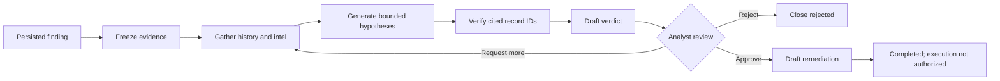

# Phase 3 AI Validation and LangGraph Acceptance

Status date: 2026-08-14

The AI layer is advisory and post-detection. Deterministic detection persists a
finding first; LangGraph then gathers read-only context, proposes bounded
hypotheses, verifies citations, drafts a verdict, and pauses for an analyst.
It never authorizes or executes remediation.



## Implemented controls

- PostgreSQL-backed LangGraph checkpoints and restart-safe resume by thread ID.
- Automatic start gates by finding event and severity.
- Bounded evidence, context, hypotheses, prompt size, and review rounds.
- Endpoint evidence treated as untrusted data and citations restricted to real
  record IDs.
- JSON Schema requests where supported plus mandatory local type/range checks.
- Inconclusive fallback for provider errors or malformed structured responses.
- Deterministic knowledge-base fallback when AI remediation drafting fails.
- Human approval before remediation drafting; generated plans remain
  `draft_only` with `execution_authorized=false`.
- Per-stage model-call audit records in review and final results, including
  contract version, provider, model, route metadata, tokens, latency, cost,
  finish reason, status, error type, and fallback source where available.
- Shared resilient transport with bounded transient retries, `Retry-After`,
  circuit breaker, metrics, and fail-fast handling for permanent errors.

Transport retry counters and breaker state are exposed through the integration
health metrics. Investigation-specific call outcomes are stored in
`review_payload.model_calls` and `result.model_calls`.

## Automated acceptance gate

Start PostgreSQL and run:

```bash
docker compose up -d postgres
make test-ai-validation
```

The gate covers:

- valid structured outputs and bounded/canonicalized citations;
- malformed output and unavailable-provider fallbacks;
- transient retry success and retry-exhausted fallback behavior;
- approval, rejection, and bounded request-more branches;
- deterministic remediation fallback and non-execution guarantees;
- durable checkpoint resume after a service restart;
- validation quality floors, error policy, persistence, recomputation, and
  observability;
- OpenRouter response/error metadata and provider controls; and
- deterministic validation behavior when AI is disabled or unavailable.

## Runtime configuration

| Setting | Purpose | Default |
| --- | --- | --- |
| `LANGGRAPH_INVESTIGATIONS_ENABLED` | Enables investigation service | `true` |
| `LANGGRAPH_AUTO_INVESTIGATE` | Starts eligible investigations automatically | `true` |
| `LANGGRAPH_AUTO_SEVERITIES` | Finding severities eligible for auto-start | `critical,high` |
| `LANGGRAPH_MAX_REVIEW_ROUNDS` | Maximum analyst request-more rounds | `2` |
| `INTEL_DATABASE_URL` | Investigation index and LangGraph checkpoint database | PostgreSQL intel DB |

The AI provider and task model are configured through the existing AI settings
API/UI. Secrets must stay in the configured key store and must never be copied
into graph state, prompts, logs, or validation documents.

## Live-provider release gate

Automated tests use deterministic fake providers and do not prove external
credentials, quotas, egress, or the selected model's current behavior. Before a
controlled deployment, run one non-sensitive test finding against each enabled
provider and retain:

1. the pending-review payload and its two successful model-call audit records;
2. the analyst approval timeline entry;
3. the final draft remediation with `execution_authorized=false`;
4. integration-health retry, latency, and breaker metrics; and
5. a restart/resume check using the deployment's PostgreSQL service.

Do not use production secrets or customer telemetry in a provider smoke test.
