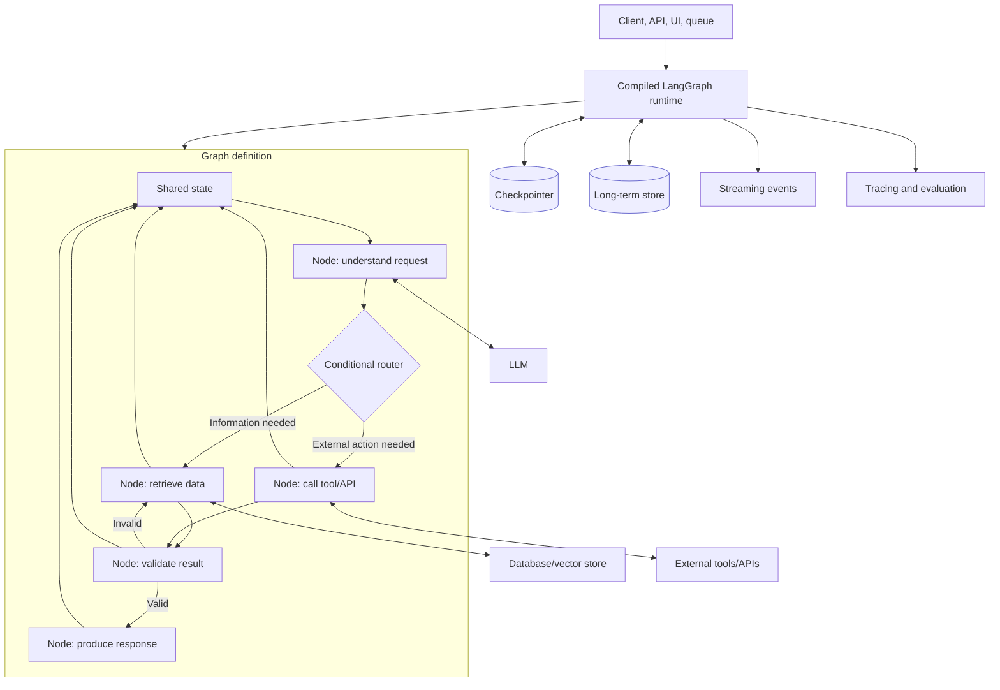

# LangGraph: Detailed Guide

## 1. What is LangGraph?

LangGraph is a low-level orchestration framework and runtime for building **stateful, multi-step AI applications**.

It is especially useful for AI agents that need to:

- Call language models repeatedly
- Use tools, APIs, databases, or code execution
- Make conditional decisions
- Loop until a task is complete
- Run work in parallel
- Remember conversation or job state
- Pause for human approval
- Resume after interruption or failure
- Stream intermediate progress
- Be inspected, tested, and monitored

The simplest mental model is:

> **LangGraph is a state machine and workflow engine for AI agents.**

The language model provides intelligence. LangGraph controls the execution process.

LangGraph can be used independently, but it integrates well with LangChain. LangChain provides model and tool integrations, while LangGraph provides orchestration and runtime capabilities.

Official overview: <https://docs.langchain.com/oss/python/langgraph/overview>

---

## 2. Why do we need LangGraph?

A simple LLM application looks like this:

```text
User question -> LLM -> Answer
```

Production AI applications usually look more like this:

```text
User request
    -> classify intent
    -> retrieve information
    -> call an external API
    -> validate the result
    -> retry if necessary
    -> ask for human approval
    -> perform an action
    -> save progress
    -> produce a final response
```

You can implement this with ordinary Python functions, but the code becomes difficult to maintain when it includes:

- Branches and loops
- Multiple LLM calls
- Tool-calling cycles
- Parallel work
- Long-running jobs
- Transient API failures
- Human-in-the-loop approval
- Conversation memory
- Recovery after process crashes
- Debugging of intermediate decisions

LangGraph provides a standard model for representing and executing these workflows.

---

## 3. Core mental model

| LangGraph concept | Simple analogy | Meaning |
|---|---|---|
| State | Shared notebook | Data available to the workflow and its nodes |
| Node | Worker | A function that performs one unit of work |
| Edge | Road | A connection to the next node |
| Conditional edge | Junction | Chooses a path based on current state |
| Reducer | Merge rule | Defines how updates are combined |
| Checkpoint | Saved game | A persisted snapshot of execution state |
| Thread | Conversation/job ID | Identifies one execution history |
| Store | Long-term memory | Data shared across multiple threads |
| Interrupt | Pause button | Stops execution and waits for external input |
| Subgraph | Reusable mini-workflow | A graph embedded inside another graph |
| `Send` | Dynamic worker creation | Sends separate state to runtime-created workers |
| `Command` | Update plus navigation | Changes state and selects the next node |

The three fundamental concepts are:

1. **State** — what the application currently knows.
2. **Nodes** — what the application does.
3. **Edges** — what the application does next.

---

## 4. High-level architecture



LangGraph does not replace your model provider, database, or business APIs. It coordinates them.

---

## 5. How a graph executes

Suppose the graph is:

```text
START -> classify -> retrieve -> generate -> END
                         ^          |
                         |----------|
                           retry loop
```

Execution works conceptually as follows:

1. The application invokes the compiled graph with an initial state.
2. The `START` node activates the first application node.
3. The node reads the current state.
4. The node performs computation, an LLM call, or an external side effect.
5. The node returns a partial state update.
6. LangGraph applies reducers to merge the update into state.
7. Edges determine the next node or nodes.
8. Parallel nodes can execute during the same runtime step.
9. A checkpoint can be written after execution steps.
10. The graph ends at `END`, pauses at an interrupt, or continues through a loop.

LangGraph is inspired by Pregel-style message passing. Nodes become active when they receive new state/messages, execute, and pass updates onward. This makes parallel fan-out and fan-in possible.

---

## 6. State

State is the shared data structure for the graph.

```python
from typing_extensions import TypedDict


class SupportState(TypedDict):
    customer_message: str
    intent: str
    documents: list[str]
    customer_history: dict
    draft_response: str
    approved: bool
```

Every node receives the current state and usually returns a dictionary containing only the fields it changed.

```python
def classify_message(state: SupportState):
    return {"intent": "billing"}
```

The node does not need to return the entire state.

### State design rules

Store information that:

- Is needed by later nodes
- Is expensive to recompute
- Must survive an interruption
- Is useful for debugging or audit history

Avoid storing:

- Prompt templates
- Values easily derived from existing fields
- Temporary local variables
- Secrets when they can be injected through runtime configuration

Prefer raw data in state and construct prompts inside nodes. This keeps state easier to inspect and allows different nodes to format the same data differently.

### State schema choices

LangGraph supports common Python schema styles:

- `TypedDict`: lightweight and fast
- Dataclass: useful for defaults
- Pydantic model: useful for validation, with extra runtime overhead

---

## 7. Reducers

A reducer defines how a node's update is applied to a state key.

By default, a value is replaced:

```python
class State(TypedDict):
    status: str
```

If a node returns:

```python
{"status": "completed"}
```

the previous status is replaced.

For accumulated values, use a reducer:

```python
import operator
from typing import Annotated
from typing_extensions import TypedDict


class State(TypedDict):
    findings: Annotated[list[str], operator.add]
```

Now two parallel nodes can return:

```python
{"findings": ["Database looks healthy"]}
```

and:

```python
{"findings": ["API latency is elevated"]}
```

The combined value becomes:

```python
["Database looks healthy", "API latency is elevated"]
```

Reducers are essential when multiple parallel nodes write to the same state key. Without a compatible reducer, LangGraph cannot know how to merge concurrent updates.

For message-based agents, LangGraph provides message-oriented reducers such as `add_messages`, which handles message IDs and message object deserialization.

---

## 8. Nodes

A node is a synchronous or asynchronous Python function.

```python
def retrieve_documents(state):
    question = state["question"]
    documents = vector_store.search(question)
    return {"documents": documents}
```

A node may:

- Call an LLM
- Call a tool
- Query a database
- Transform data
- Apply business rules
- Ask for human input
- Route to another node
- Return state updates

Good node design:

- Give each node one clear responsibility.
- Keep external side effects isolated.
- Return structured updates.
- Make side effects idempotent where possible.
- Add separate retry policies for different failure types.
- Keep nodes small enough to test independently.

### Node granularity

Small nodes provide:

- Better checkpoints
- More precise retries
- Easier testing
- Better streaming progress
- More detailed tracing

Very small nodes can create unnecessary complexity, so split at meaningful boundaries such as an API call, an LLM call, a human review step, or a business decision.

---

## 9. Edges and routing

### Normal edge

Use a normal edge for fixed control flow:

```python
builder.add_edge("retrieve", "generate")
```

### Conditional edge

Use a conditional edge for dynamic routing:

```python
def route_by_intent(state):
    return state["intent"]


builder.add_conditional_edges(
    "classify",
    route_by_intent,
    {
        "billing": "billing_agent",
        "technical": "technical_agent",
        "general": "general_agent",
    },
)
```

### Entry and exit

`START` identifies the beginning of the graph. `END` identifies a terminal point.

Do not mix a normal edge and dynamic routing from the same node unless you intentionally want both paths to execute. Prefer one clear routing mechanism per node.

---

## 10. `Command`: update state and route together

`Command` is useful when a node needs to update state and select the next node in one operation.

```python
from langgraph.types import Command


def validate_payment(state):
    if state["payment_valid"]:
        return Command(
            update={"status": "approved"},
            goto="capture_payment",
        )

    return Command(
        update={"status": "rejected"},
        goto="notify_customer",
    )
```

This can make complex routing explicit at the point where the decision is made.

---

## 11. `Send`: dynamic parallel workers

Sometimes the number of tasks is not known when the graph is designed.

Example: an orchestrator receives a report topic and creates one worker per section.

```text
Create plan
   |
   +--> worker: Introduction
   +--> worker: Architecture
   +--> worker: Security
   +--> worker: Testing
            |
        Combine results
```

`Send` lets a conditional route dynamically create worker executions, each with its own input state. This is useful for map-reduce workflows, document processing, and orchestrator-worker systems.

---

## 12. Persistence and checkpoints

Persistence means saving graph state as checkpoints.

```python
from langgraph.checkpoint.memory import InMemorySaver

checkpointer = InMemorySaver()
graph = builder.compile(checkpointer=checkpointer)

config = {
    "configurable": {
        "thread_id": "ticket-123"
    }
}

result = graph.invoke(initial_state, config=config)
```

### What persistence enables

- Resume after failure
- Multi-turn conversations
- Human approval workflows
- State inspection
- Time-travel debugging
- Forking from an earlier checkpoint
- Durable long-running jobs

### Threads

A thread is a logical execution history identified by a `thread_id`.

```text
thread_id = customer-42-conversation-7
```

Reuse the same ID to continue the same conversation or job. Use a new ID to start a new thread.

Use an in-memory checkpointer for experiments. Use a durable database-backed checkpointer in production.

Official persistence documentation: <https://docs.langchain.com/oss/python/langgraph/persistence>

---

## 13. Short-term and long-term memory

### Short-term memory

Short-term memory belongs to one thread. It commonly includes:

- Conversation messages
- Current task information
- Retrieved documents
- Intermediate results
- Pending approvals

It is normally stored in graph state and persisted through checkpoints.

### Long-term memory

Long-term memory is shared across threads. It can contain:

- User preferences
- Customer profile information
- Previously learned facts
- Organization settings
- Reusable knowledge

Conceptually:

```text
Thread A ─┐
Thread B ─┼── Long-term store for user 42
Thread C ─┘
```

A checkpointer stores thread-scoped state. A store is used for data that must be available across multiple threads.

---

## 14. Human-in-the-loop with interrupts

Use `interrupt()` when the workflow needs external input.

```python
from langgraph.types import interrupt


def approve_deployment(state):
    decision = interrupt({
        "question": "Approve production deployment?",
        "version": state["version"],
        "risk_summary": state["risk_summary"],
    })

    return {"approved": decision}
```

The graph pauses, saves its state, and waits. The caller later resumes the same thread with the human's answer.

Common uses:

- Approve production changes
- Confirm financial transactions
- Approve outgoing emails
- Request missing customer information
- Review generated documents
- Confirm deletion or destructive actions

Important: when an interrupted graph resumes, the node containing the interrupt may execute again from its beginning. Code before the interrupt should be safe to repeat.

Official interrupt documentation: <https://docs.langchain.com/oss/python/langgraph/interrupts>

---

## 15. Error handling and fault tolerance

Different errors need different strategies.

| Error type | Recommended response |
|---|---|
| Temporary network failure | Retry with backoff |
| Rate limit | Retry after delay |
| Invalid tool result | Send error back to model or validation loop |
| Missing user information | Interrupt and ask the user |
| Payment/API failure | Recovery or compensation branch |
| Unexpected programmer error | Let it surface for debugging |

Conceptually:

```text
Call external API
      |
   failure
      |
retry 1 -> retry 2 -> retry 3
                         |
                    recovery branch
```

Use node-level retry policies for transient errors. Use explicit state updates and loops when the LLM can correct its own plan. Use human interrupts for issues only a person can resolve.

For workflows involving transactions, design compensation actions. For example, if payment succeeds but shipping creation fails, the recovery branch may refund or mark the order for manual review.

Official fault-tolerance documentation: <https://docs.langchain.com/oss/python/langgraph/fault-tolerance>

---

## 16. Streaming

LangGraph can stream:

- Complete state values
- Per-node state updates
- LLM token messages
- Tool events
- Lifecycle events
- Custom progress messages

This allows a UI to show:

```text
Classifying request...        done
Searching internal documents... running
Generating response...        waiting
```

Streaming is important for long-running workflows because users can see progress instead of waiting for one final response.

Official streaming documentation: <https://docs.langchain.com/oss/python/langgraph/streaming>

---

## 17. Graph API versus Functional API

LangGraph provides two main styles.

| Graph API | Functional API |
|---|---|
| Explicit nodes and edges | Ordinary Python control flow |
| Explicit shared state | State scoped to functions/tasks |
| Easy to visualize | Less graph boilerplate |
| Good for branching and loops | Good for adding durability to existing code |
| Uses `StateGraph` | Uses `@entrypoint` and `@task` |

Use the Graph API when the workflow structure itself is important. Use the Functional API when you already have a mostly normal Python workflow and want checkpointing, memory, interrupts, or streaming with fewer structural changes.

Both use the same underlying runtime.

Official Functional API documentation: <https://docs.langchain.com/oss/python/langgraph/functional-api>

---

## 18. Complete small example

The following example shows state, nodes, conditional routing, and compilation without requiring an LLM.

```python
from typing import Literal
from typing_extensions import TypedDict, NotRequired
from langgraph.graph import StateGraph, START, END


class TicketState(TypedDict):
    text: str
    route: NotRequired[Literal["docs", "human"]]
    context: NotRequired[str]
    response: NotRequired[str]


def classify(state: TicketState):
    if "refund" in state["text"].lower():
        return {"route": "human"}
    return {"route": "docs"}


def select_route(state: TicketState):
    return state["route"]


def lookup_docs(state: TicketState):
    return {
        "context": "Password reset is available under Settings > Security."
    }


def draft_answer(state: TicketState):
    return {
        "response": f"Documentation result: {state['context']}"
    }


def send_to_human(state: TicketState):
    return {
        "response": "This request was queued for human review."
    }


builder = StateGraph(TicketState)

builder.add_node("classify", classify)
builder.add_node("lookup_docs", lookup_docs)
builder.add_node("draft_answer", draft_answer)
builder.add_node("send_to_human", send_to_human)

builder.add_edge(START, "classify")

builder.add_conditional_edges(
    "classify",
    select_route,
    {
        "docs": "lookup_docs",
        "human": "send_to_human",
    },
)

builder.add_edge("lookup_docs", "draft_answer")
builder.add_edge("draft_answer", END)
builder.add_edge("send_to_human", END)

graph = builder.compile()

result = graph.invoke({
    "text": "How can I reset my password?"
})

print(result["response"])
```

The state evolves like this:

```text
Initial:
{ text: "How can I reset my password?" }

After classify:
{ text: "...", route: "docs" }

After lookup_docs:
{ text: "...", route: "docs", context: "Password reset..." }

After draft_answer:
{ text: "...", route: "docs", context: "...", response: "..." }
```

---

## 19. Common workflow patterns

### Prompt chaining

```text
Extract -> Transform -> Summarize
```

Use when each stage depends on the previous stage.

### Routing

```text
Request -> Classify -> Specialist A/B/C
```

Use when different requests need different workflows.

### Parallelization

```text
Request -> Search A
        -> Search B
        -> Search C
                 -> Combine
```

Use to reduce latency or compare independent results.

### Orchestrator-worker

```text
Planner -> dynamic workers -> synthesizer
```

Use when the planner must decide the number and type of subtasks.

### Evaluator-optimizer

```text
Generate -> Evaluate -> Improve -> Evaluate -> Finish
```

Use when output must meet a quality criterion.

### Agent loop

```text
LLM decides -> tool call -> tool result -> LLM decides again
```

Use when the problem and required tools are unpredictable.

Official patterns: <https://docs.langchain.com/oss/python/langgraph/workflows-agents>

---

## 20. Practical use cases

### Customer support

```text
Read ticket
 -> classify topic and urgency
 -> retrieve documentation
 -> fetch customer history
 -> draft response
 -> escalate sensitive cases
 -> human approval
 -> send reply
```

### Retrieval-augmented generation with verification

```text
Question
 -> retrieve documents
 -> grade relevance
 -> rewrite query if needed
 -> retrieve again
 -> generate answer
 -> verify citations
```

### Coding agent

```text
Understand issue
 -> inspect repository
 -> plan changes
 -> edit files
 -> run tests
 -> inspect failures
 -> fix and retry
 -> request review
```

### Security investigation

```text
Alert
 -> collect logs
 -> enrich indicators
 -> query threat intelligence
 -> estimate severity
 -> recommend response
 -> human approval
 -> execute containment
 -> produce audit report
```

### Deployment assistant

```text
Change request
 -> validate configuration
 -> run tests
 -> estimate risk
 -> ask for approval
 -> deploy
 -> monitor health
 -> rollback if needed
```

### Document processing

```text
Upload document
 -> split into sections
 -> process sections in parallel
 -> validate extraction
 -> combine structured result
 -> send for review if confidence is low
```

---

## 21. LangChain, LangGraph, and LangSmith

### LangChain

LangChain is primarily an agent and application framework. It provides:

- Model integrations
- Tool abstractions
- Prompt templates
- Retrieval components
- Structured output
- Prebuilt agents

### LangGraph

LangGraph is the orchestration runtime. It provides:

- State management
- Explicit workflow control
- Branches and loops
- Persistence
- Interrupts
- Durable execution
- Streaming
- Subgraphs

### LangSmith

LangSmith provides:

- Tracing
- Debugging
- Evaluation
- Prompt management
- Monitoring
- Deployment support

Short version:

```text
LangChain = building blocks
LangGraph = execution control
LangSmith = visibility and evaluation
```

---

## 22. When to use LangGraph

Use LangGraph when the application has one or more of these requirements:

- Multi-step execution
- Conditional routing
- Loops
- Tool-calling agents
- Human approvals
- Persistent conversations
- Long-running tasks
- Recovery from failure
- Parallel work
- Multiple cooperating agents
- Need for detailed tracing and state inspection

Do not use it for a simple one-call application:

```text
Prompt -> LLM -> Answer
```

For a simple chatbot or standard tool-calling agent, a higher-level LangChain agent may be sufficient.

---

## 23. Design checklist

Before implementing a LangGraph workflow, answer these questions:

1. What is the business process?
2. Which steps are deterministic code?
3. Which steps require an LLM?
4. Which steps call external systems?
5. What information must survive between steps?
6. What are the possible routes?
7. Where can the workflow loop?
8. What is the stopping condition?
9. Which errors are retryable?
10. Where is human approval required?
11. Which operations must be idempotent?
12. What should be stored per thread?
13. What should be stored across threads?
14. Which steps can run in parallel?
15. What should be streamed to the user?
16. How will you trace and evaluate the workflow?

---

## 24. Recommended learning path

### Stage 1: Graph fundamentals

Build a graph with normal Python functions. Learn state, nodes, edges, `START`, and `END`.

### Stage 2: Routing and loops

Add conditional edges and a clear loop termination condition.

### Stage 3: LLM integration

Replace one deterministic node with an LLM call. Prefer structured output for routing decisions.

### Stage 4: Tool integration

Add a database query, web search, or API call as a node.

### Stage 5: Persistence

Add a checkpointer and use a `thread_id`.

### Stage 6: Human-in-the-loop

Add `interrupt()` before sensitive or irreversible actions.

### Stage 7: Production reliability

Add retries, timeouts, idempotency, compensation flows, logging, and observability.

### Stage 8: Advanced orchestration

Learn parallel workers, `Send`, `Command`, subgraphs, streaming, and evaluator-optimizer loops.

---

## 25. Key principles to remember

1. **Nodes do the work.**
2. **Edges control the flow.**
3. **State records what the workflow knows.**
4. **Reducers define how concurrent updates merge.**
5. **Checkpoints make execution resumable.**
6. **Threads identify persistent conversations or jobs.**
7. **Interrupts make human approval a first-class step.**
8. **Small nodes improve testing, retries, and observability.**
9. **The LLM should decide only where language understanding is needed.**
10. **Business rules, security checks, permissions, and irreversible actions should remain explicit and deterministic.**

The most important summary is:

> **LangGraph lets you turn an unpredictable LLM interaction into a controlled, stateful, observable, and resumable workflow.**

---

## 26. Official resources

- [LangGraph overview](https://docs.langchain.com/oss/python/langgraph/overview)
- [Graph API](https://docs.langchain.com/oss/python/langgraph/graph-api)
- [Quickstart](https://docs.langchain.com/oss/python/langgraph/quickstart)
- [Thinking in LangGraph](https://docs.langchain.com/oss/python/langgraph/thinking-in-langgraph)
- [Workflows and agents](https://docs.langchain.com/oss/python/langgraph/workflows-agents)
- [Persistence](https://docs.langchain.com/oss/python/langgraph/persistence)
- [Memory](https://docs.langchain.com/oss/python/langgraph/add-memory)
- [Interrupts](https://docs.langchain.com/oss/python/langgraph/interrupts)
- [Streaming](https://docs.langchain.com/oss/python/langgraph/streaming)
- [Fault tolerance](https://docs.langchain.com/oss/python/langgraph/fault-tolerance)
- [Functional API](https://docs.langchain.com/oss/python/langgraph/functional-api)
